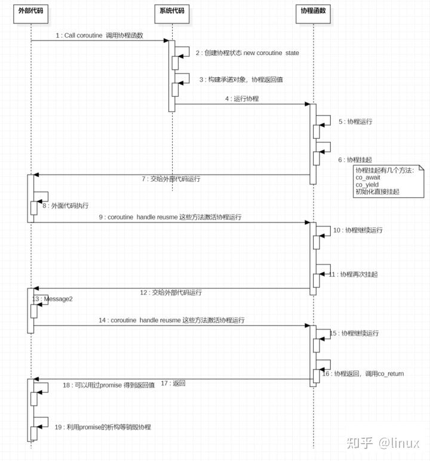
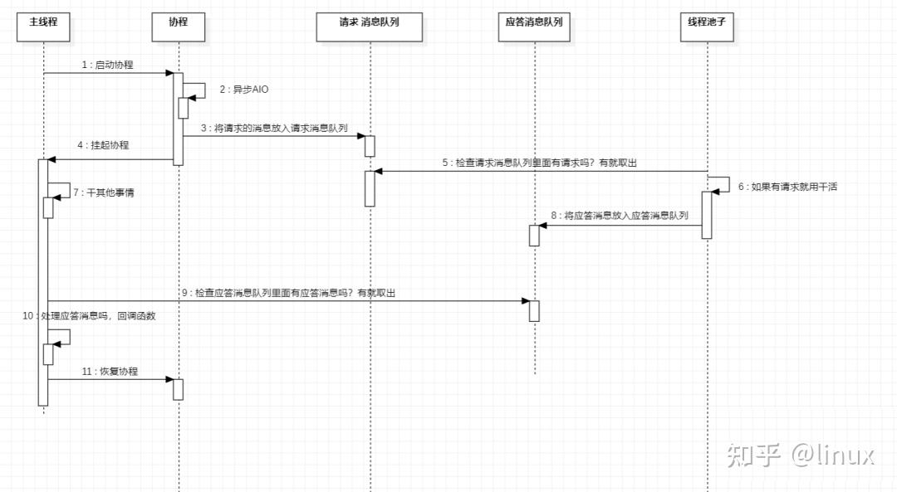

<!--
 * @Author: running-code-pp 3320996652@qq.com
 * @Date: 2025-10-09 01:50:46
 * @LastEditors: running-code-pp 3320996652@qq.com
 * @LastEditTime: 2025-10-20 10:59:34
 * @FilePath: \note\note\cpp\语言特性\corotine.md
 * @Description: 
 * @Copyright: Copyright (c) 2025 by ${git_name}, All Rights Reserved.
-->
# 什么是协程
协程只能被被线程调用，本身并不抢占内核调度，分为无栈协程和有栈协程，无栈指可以挂起/恢复的函数，有栈协程则相当于用户态协程，有栈协程切换的成本是用户态线程切换的成本，而无栈协程切换的成本则相当于函数调用的成本

C++20中的协程可以看作一种特殊的函数，可以被挂起和恢复，在需要时恢复在等待时挂起

比如一个http请求，在发起请求之后挂起，得到响应或者超时的时候再恢复

c++20协程调用图



# c++20协程的重要概念
## 协程状态
记录协程状态的帧，不过和函数栈帧不同，协程状态帧是分配与堆内存的

- 承诺对象
- 形参
- 挂起点
- 临时变量
- 运行的状态
- 

## 承诺对象promise
实现若干接口，用于辅助协程，构造协程函数返回值，提交传递co_yield/co_return的返回值。
明确协程启动阶段是否立即挂起，以及协程内部发生异常的处理方式

**接口必须包括：**
- **auto get_return_object()** ：用于生成协程函数的返回对象。
- **auto initial_suspend()**：用于明确初始化后，协程函数的执行行为，返回值为等待体（awaiter），用co_wait调用其返回值。返回值为std::suspend_always 表示协程启动后立即挂起（不执行第一行协程函数的代码），返回std::suspend_never 表示协程启动后不立即挂起。（当然既然是返回等待体，你可以自己在这儿选择进行什么等待操作）
- **void return_value(T v)**：调用co_return v后会调用这个函数，可以保存co_return的结果
- **auto yield_value(T v)**：调用co_yield后会调用这个函数，可以保存co_yield的结果，其返回其返回值为std::suspend_always表示协程会挂起，如果返回std::suspend_never表示不挂起。
- **auto final_suspend() noexcept**：在协程退出时调用的接口，返回std::suspend_never ，自动销毁 coroutine state 对象。若 final_suspend 返回 std::suspend_always 则需要用户自行调用 handle.destroy() 进行销毁。但值得注意的是返回std::suspend_always并不会挂起协程。
承诺对象必须是result::promise_type这种，也就是必须是协程返回值类的子类型

**不必须包括：**\
重载 operator new/operator delete 使用自己的内存分配接口管理协程的状态帧


## 协程句柄 coroutine handle
协程的唯一标识，用于恢复协程和销毁协程状态帧\
表现形式为:std::coroutine_handle<promise_type>,其模板参数为承诺对象类型，句柄有几个重要的函数:
- resume: 恢复协程
- done: 判断协程是否已经执行完成，false表示还在挂起

协程句柄和承诺对象之间可以互相转换:
- std::coroutine_handle<promise_type>::from_promise
- std::coroutine_handle<promise_type>::promise() 
  
## 等待体 awaiter
co_await关键字调用的对象
这个对象内部也有三个接口:
- bool await_ready(): 等待体是否转杯好了，返回false表示协程没准备好，立即调用await_suspend，返回true表示准备好了
- auto await_suspend(std::coroutine_handle<>handle) 如果要挂起，调用的接口，返回值有三种可能void(同true)/bool(true->立即挂起，false->不挂起)/协程句柄(立即恢复该句柄对应协程的运行)

**等待体有两个特化类**
- std::suspend_never: 不挂起的特化等待体
- std::suspend_always: 挂起的特化等待体类型
  
# c++20协程提供的api
## co_await
co_await 调用一个awaiter对象，根据其内部定义决定是挂起还是继续，以及挂起和恢复时的行为

## co_yield
挂起协程

co_yield cy_ret;(cy_ret会保存在promise对象中)，协程外部可以通过promise得到

## co_return
协程返回,co_return cr_ret;

cr_ret会保存在promise对象中，协程外部可以通过promise得到，cr_ret并不是协程的返回值

# 使用示例
```cpp
/**
 * @Author: running-code-pp 3320996652@qq.com
 * @Date: 2025-10-18 16:34:22
 * @LastEditors: running-code-pp 3320996652@qq.com
 * @LastEditTime: 2025-10-18 17:47:25
 * @FilePath: \asio-learn-code\src\coroutine\coroutine_01.cpp
 * @Description: C++20协程入门示例01
 * @Copyright: Copyright (c) 2025 by ${git_name}, All Rights Reserved.
 */

// 定义协程返回值类型
#include <stdio.h>

#include <coroutine>
#include <iostream>
#include <thread>

template<typename T>
struct coro_ret
{
  struct promise_type;
  using handle_type = std::coroutine_handle<promise_type>;
  // 协程句柄
  handle_type _coro_handle;

  coro_ret(handle_type h) : _coro_handle(h)
  {
  }
  coro_ret(coro_ret&& other) : _coro_handle(other._coro_handle)
  {
    other._coro_handle = nullptr;
    return *this;
  }
  coro_ret(const coro_ret&) = delete;
  ~coro_ret()
  {
    // 销毁协程
    if (_coro_handle)
    {
      _coro_handle.destroy();
    }
  }

  // 恢复协程，返回是否结束
  bool move_next()
  {
    _coro_handle.resume();
    return _coro_handle.done();
  }

  // 获取返回值
  T get()
  {
    return _coro_handle.promise()._return_value;
  }

  // 定义承诺对象
  struct promise_type
  {
    // 返回值
    T _return_value;
    // 几个必须定义的接口
    // 生成协程函数的返回对象
    auto get_return_object()
    {
      printf("get_return_object was called\n");
      return coro_ret{ handle_type::from_promise(*this) };
    }

    // 确定协程初始化之后的行为，返回等待体
    auto initial_suspend()
    {
      printf("initial_suspend was called\n");
      return std::suspend_always{};  // 立即挂起
    }

    // co_return之后调用的行为
    void return_value(T value)
    {
      printf("return_value was called\n");
      _return_value = value;
      return;
    }

    // co_yield之后调用的行为
    auto yield_value(T value)
    {
      printf("yield_value was called\n");
      _return_value = value;
      return std::suspend_always{};  // 立即挂起
    }

    // 协程退出时调用的行为
    auto final_suspend() noexcept
    {
      printf("final_suspend was called\n");
      return std::suspend_always{};  // 协程结束时挂起
    }

    void unhandled_exception()
    {
      std::exit(1);
    }

  };
};

// 定义协程函数
coro_ret<int> simple_coroutine()
{
  printf("coroutine started\n");
  co_await std::suspend_never{};  // 不会挂起
  printf("1st suspend coroutine\n");
  co_await std::suspend_always{};  // 挂起协程
  printf("2nd suspend coroutine\n");
  co_yield 42;                    // 挂起协程并返回值42
  printf("3rd suspend coroutine\n");
  co_yield 100;                  // 返回值100并结束协程
  co_return 200;                  // 结束协程
}

int main(){
    bool done = false;
    auto coro_ret = simple_coroutine();
    printf("coroutine %s ret =%d\n", done ? "done" : "not done", coro_ret.get());
    done = coro_ret.move_next();
    printf("coroutine %s ret =%d\n", done ? "done" : "not done", coro_ret.get());
    done = coro_ret.move_next();
    printf("coroutine %s ret =%d\n", done ? "done" : "not done", coro_ret.get());
    done = coro_ret.move_next();
    printf("coroutine %s ret =%d\n", done ? "done" : "not done", coro_ret.get());
    done = coro_ret.move_next();
    printf("coroutine %s ret =%d\n", done ? "done" : "not done", coro_ret.get());

    return 0;
}
/*
运行结果：
get_return_object was called
initial_suspend was called
coroutine not done ret =0
coroutine started
1st suspend coroutine
coroutine not done ret =0
2nd suspend coroutine
yield_value was called
coroutine not done ret =42
3rd suspend coroutine
yield_value was called
coroutine not done ret =100
return_value was called
final_suspend was called
coroutine done ret =200
*/
```

# 协程的最佳实践



# c++20中协程的实现原理