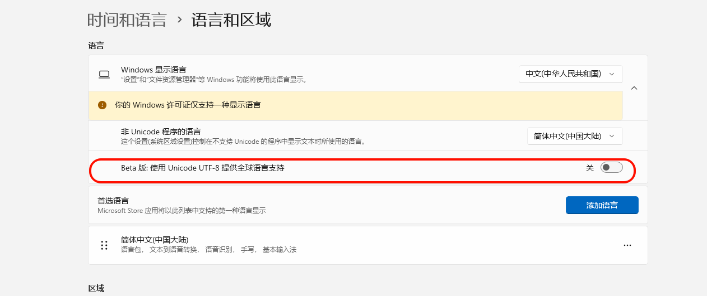

# 编译器内部错误，但是代码并没有修改
```
生成开始于 10:19...
1>------ 已启动生成: 项目: quickfix, 配置: Release x64 ------
1>Acceptor.cpp
1>Acceptor.cpp : fatal error C1001: 编译器中发生内部错误。
1>(编译器文件“f:\dd\vctools\compiler\cxxfe\sl\p1\c\p0io.c”，第 2807 行)
1> 要解决此问题，请尝试简化或更改上面所列位置附近的程序。
1>请选择 Visual C++
1>“帮助”菜单上的“技术支持”命令，或打开技术支持帮助文件来获得详细信息。
1>DataDictionary.cpp
1>c1xx : fatal error C1001: 编译器中发生内部错误。
1>(编译器文件“msc1.cpp”，第 1325 行)
1> 要解决此问题，请尝试简化或更改上面所列位置附近的程序。
1>请选择 Visual C++
1>“帮助”菜单上的“技术支持”命令，或打开技术支持帮助文件来获得详细信息。
1>“D:\Program Files (x86)\Microsoft Visual Studio 12.0\VC\bin\amd64\CL.exe”中的内部编译器错误
1>    请选择 Visual C++
1>“帮助”菜单上的“技术支持”命令，或打开技术支持帮助文件来获得详细信息
1>已完成生成项目“quickfix_vs12.vcxproj”的操作 - 失败。
========== 生成: 0 成功，1 失败，0 最新，0 已跳过 ==========
========== 生成 于 10:19 完成，耗时 01.749 秒 ==========
```
代码并没有修改但是还是报这个错误，最终排查发现是开启了beta版本的UTF8支持了，关闭之后没有这个问题了


