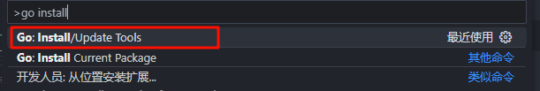

# 安装
[官网](https://golang.google.cn/)

配置系统变量
- GOROOT设置为go安装目录
- GOPATH设置为go工程目录（可以另外建一个）用户变量中的GOPATH也要设置为一致

# vscode go开发环境搭建

**插件**
- Go
- Error Lens
- Paste Json as Code
- TODO Highlight
- vscode-proto3

**更新相关工具**
