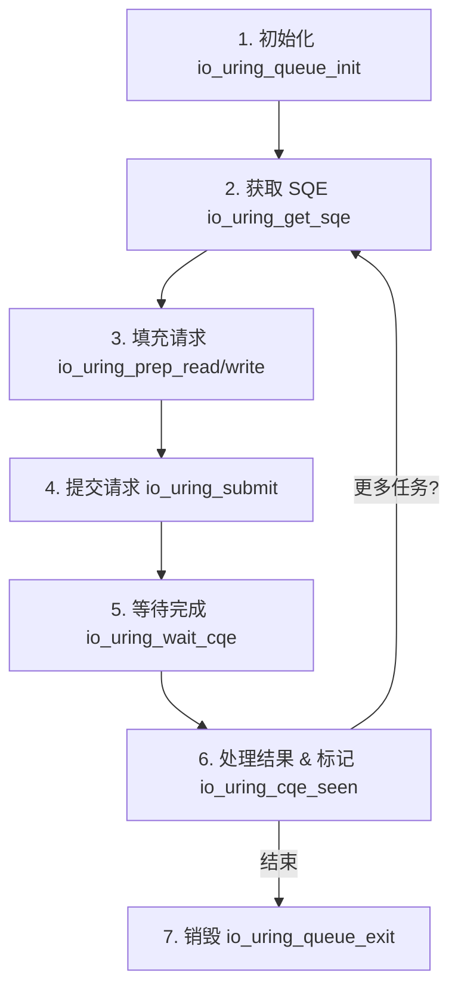
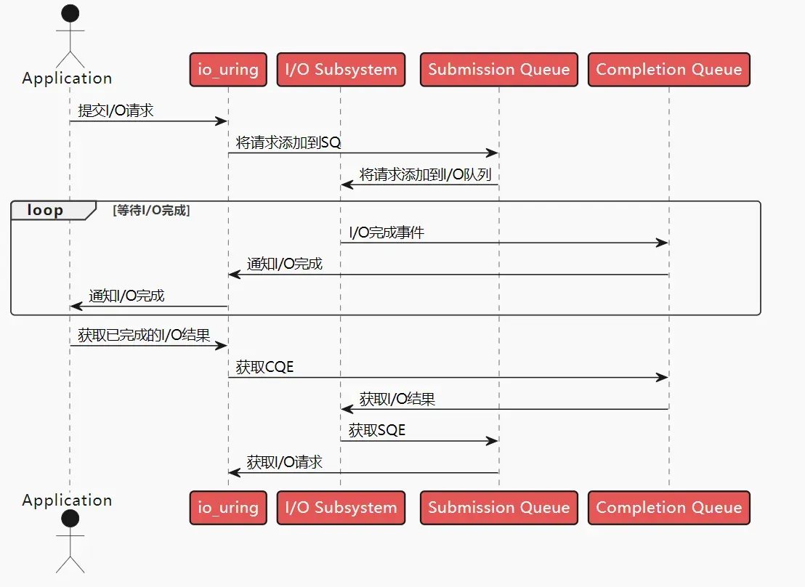

# 简介
```
io_uring 是 2019 年 Linux 5.1 内核首次引入的高性能 异步 I/O 框架，能显著加速 I/O 密集型应用的性能。
同通过一对环形缓冲实现用户空间和内核空间之间的通信，用户空间可以直接向内核提交IO请求，并从内核获取IO结果，无需等待或切换上下文，大大提高了异步IO操作的效率和性能
```





每个io_uring实例都有两个环形队列，
- 提交队列：submission queue( SQ )
- 完成队列：completion queue( CQ )


- 队列的实现
两个队列都是单生产单消费，size为2的幂
提供无锁接口，内部使用内存屏障来同步

- 请求时：
应用创建 SQ Entries (SQE)，更新 SQ tail
内核消费 SQE，更新 SQ head

- 完成后：
内核为完成的一个或多个请求创建 CQ Entries (CQE)，更新 CQ tail
应用消费 CQE，更新 CQ head
完成事件可能以任意顺序到达，到总是与特定的 SQE 相关联的
消费 CQE 过程无需切换内核态

- 这样做的好处在于：
原本需要多次系统调用，现在变成批处理一次提交
此外，io_uring 使异步 I/O 的使用场景也不再仅限于数据库应用， 普通的非数据库应用也能用

# io_uring 的 三个系统调用
- io_uring_setup 创建io_uring实例
- io_uring_register 向io_uring中注册资源
- io_uring_enter: 向io_uring提交IO请求或等待IO完成事
  
```cpp
/**
 * @brief 创建一个新的 io_uring 实例。
 *
 * 该函数初始化一个 submission queue (SQ) 和一个 completion queue (CQ)，二者大小均为 @p entries，
 * 并在用户空间与内核之间共享内存，避免了 I/O 提交和完成时的数据拷贝开销。
 *
 * @param[in] entries   SQ 和 CQ 的条目数量，必须是 2 的幂。若为 0，则使用默认值（通常为 4096）。
 * @param[in,out] p     指向 io_uring_params 结构的指针，用于配置 io_uring 行为（如 flags、sq_thread_cpu 等）。
 *                      内核可能修改此结构以返回实际使用的参数。
 *
 * @return 成功时返回一个文件描述符（fd），用于后续的 io_uring 操作；
 *         失败时返回 -1，并设置 errno。
 *
 * @note
 * - SQ 和 CQ 的内存通过 mmap() 映射到用户空间，由应用直接访问。
 * - entries 必须是 2 的幂，否则返回 EINVAL。
 */
int io_uring_setup(unsigned entries, struct io_uring_params *p);

/**
 * @brief 向 io_uring 实例注册资源（如缓冲区或文件描述符），以优化异步 I/O 性能。
 *
 * 注册操作使内核能够长期持有对用户内存或文件的引用，避免每次 I/O 都进行地址解析或权限检查，
 * 从而显著降低 per-I/O 的开销。
 *
 * @param[in] fd        由 io_uring_setup() 返回的 io_uring 文件描述符。
 * @param[in] opcode    注册操作类型，例如：
 *                      - IORING_REGISTER_BUFFERS：注册用户缓冲区
 *                      - IORING_REGISTER_FILES：注册文件描述符数组
 * @param[in] arg       指向资源数组的指针：
 *                      - 对于 IORING_REGISTER_BUFFERS：指向 struct iovec 数组
 *                      - 对于 IORING_REGISTER_FILES：指向 int 数组（文件描述符）
 * @param[in] nr_args   @p arg 数组中的元素个数。
 *
 * @return 成功返回 0；失败返回 -1，并设置 errno。
 *
 * @note
 * - 注册的缓冲区会被锁定在物理内存中，计入 RLIMIT_MEMLOCK 限制。
 * - 缓冲区必须来自匿名内存（如 malloc() 或带 MAP_ANONYMOUS 的 mmap()）。
 * - 单个缓冲区最大支持 1GB。
 * - Huge pages 可用，但整个 huge page 会被 pin 入内存。
 * - 已注册的缓冲区无法调整大小；需先 unregister 再重新注册。
 * - 注册文件描述符会增加其内核引用计数，直到显式 unregister。
 */
int io_uring_register(int fd, unsigned int opcode, const void *arg, unsigned int nr_args);


/**
 * @brief 提交 I/O 请求并/或等待 I/O 完成事件。
 *
 * 该系统调用是 io_uring 的核心入口，可同时完成以下操作：
 * - 提交 SQ 中的新 I/O 请求
 * - 等待 CQ 中的完成事件
 *
 * @param[in] fd            io_uring 实例的文件描述符。
 * @param[in] to_submit     要从 SQ 提交的请求数量（通常为 sqe 填充的数量）。
 * @param[in] min_complete  至少需要完成的 I/O 事件数（仅当 flags 包含 IORING_ENTER_GETEVENTS 时有效）。
 * @param[in] flags         控制行为的标志位，例如：
 *                          - IORING_ENTER_GETEVENTS：等待完成事件
 *                          - IORING_ENTER_SQ_WAKEUP：唤醒 SQ 线程（如有）
 * @param[in] sig           若指定了 IORING_ENTER_GETEVENTS，此参数应指向一个有效的 sigset_t，
 *                          用于临时替换信号掩码（类似 ppoll()）。可为 NULL。
 *
 * @return 成功时返回实际完成的事件数（>=0）；失败返回 -1 并设置 errno。
 *
 * @note
 * - 在默认（非 polling）模式下：
 *   - 若 min_complete > 0，则阻塞直到至少 min_complete 个事件完成。
 *   - 若 min_complete == 0 且 flags 含 GETEVENTS，则返回当前所有已完成事件（非阻塞）。
 * - 在 polling 模式下（通过 io_uring_params 设置）：
 *   - 内核会主动轮询设备，无需中断。
 *   - 即使 min_complete > 0，若已有事件完成则立即返回。
 * - 若未设置 IORING_ENTER_GETEVENTS，则仅提交请求，不等待完成。
 */
int io_uring_enter(unsigned int fd, unsigned int to_submit, unsigned int min_complete, unsigned int flags, sigset_t *sig);
```
  
# liburing

## io_uring的c封装
liburing: https://github.com/axboe/liburing.git ，github 有 3k多star，是io_uring作者对liburing封装的
liburing 是对于io_uring原生接口的封装和拓展，无需观察底层的复杂性

```bash
sudo apt-get install liburing-dev
```

## 核心数据结
```cpp
/*
 * Library interface to io_uring
 */

// 提交队列(sq)结构体，用于存放待处理的IO请求
struct io_uring_sq {
	unsigned *khead;           // 内核视角的队列头指针
	unsigned *ktail;           // 内核视角的队列尾指针
	// 已弃用: 使用 `ring_mask` 替代 `*kring_mask`
	unsigned *kring_mask;      // 队列大小掩码，用于索引计算
	// 已弃用: 使用 `ring_entries` 替代 `*kring_entries`
	unsigned *kring_entries;   // 队列条目数量
	unsigned *kflags;          // 内核标志位
	unsigned *kdropped;        // 丢弃的请求数量
	unsigned *array;           // SQE数组指针
	struct io_uring_sqe *sqes; // 提交队列项数组

	unsigned sqe_head;         // SQE队列头索引
	unsigned sqe_tail;         // SQE队列尾索引

	size_t ring_sz;            // 环形缓冲区大小
	void *ring_ptr;            // 环形缓冲区指针

	unsigned ring_mask;        // 环形队列掩码
	unsigned ring_entries;     // 环形队列条目数

	unsigned pad[2];           // 填充字段，保证结构体对齐
};

// 完成队列(cq)结构体，用于存放已完成的IO请求结果
struct io_uring_cq {
	unsigned *khead;           // 内核视角的完成队列头指针
	unsigned *ktail;           // 内核视角的完成队列尾指针
	// 已弃用: 使用 `ring_mask` 替代 `*kring_mask`
	unsigned *kring_mask;      // 完成队列大小掩码
	// 已弃用: 使用 `ring_entries` 替代 `*kring_entries`
	unsigned *kring_entries;   // 完成队列条目数量
	unsigned *kflags;          // 完成队列标志位
	unsigned *koverflow;       // 溢出计数器
	struct io_uring_cqe *cqes; // 完成队列项数组

	size_t ring_sz;            // 完成队列环形缓冲区大小
	void *ring_ptr;            // 完成队列环形缓冲区指针

	unsigned ring_mask;        // 完成队列环形队列掩码
	unsigned ring_entries;     // 完成队列环形队列条目数

	unsigned pad[2];           // 填充字段，保证结构体对齐
};

// io_uring主结构体，包含提交队列和完成队列
struct io_uring {
	struct io_uring_sq sq;     // 提交队列
	struct io_uring_cq cq;     // 完成队列
	unsigned flags;            // io_uring实例标志位
	int ring_fd;               // io_uring文件描述符

	unsigned features;          // 支持的特性标志
	int enter_ring_fd;         // enter系统调用使用的文件描述符
	__u8 int_flags;            // 内部标志位
	__u8 pad[3];               // 填充字段
	unsigned pad2;             // 填充字段
};
```

## 常用接口
### 初始化和销毁
```cpp
#include <liburing.h>
//初始化io_uring实例
struct io_uring ring;
int ret = io_uring_queue_init(32, &ring, 0);

// 操作实例ring

// 销毁io_uring实例
io_uring_queue_exit(&ring);

```

### 提交IO请求
```cpp
// 1. 获取空闲 SQE
struct io_uring_sqe *sqe = io_uring_get_sqe(&ring);
if (!sqe) {
    // 队列满了，需要先 submit 或者处理一些 completion
}

// 2. 准备操作 (以 Read 为例)
// 相当于 pread(fd, buf, len, offset)
io_uring_prep_read(sqe, fd, buf, len, offset);

// 3. (可选) 绑定用户数据
// cqe 返回时会带回这个 data，用于区分是哪个请求完成了
io_uring_sqe_set_data(sqe, user_data_ptr);

// 4. 提交给内核
io_uring_submit(&ring);
```
### 获取完成IO事件

```cpp
struct io_uring_cqe *cqe;

// 等待至少一个事件完成 (阻塞)
int ret = io_uring_wait_cqe(&ring, &cqe);

// 或者：非阻塞尝试获取
// int ret = io_uring_peek_cqe(&ring, &cqe);

if (ret == 0) {
    // 检查操作结果 (res 相当于系统调用的返回值)
    if (cqe->res < 0) {
        fprintf(stderr, "Async operation failed: %s\n", strerror(-cqe->res));
    } else {
        printf("Read %d bytes\n", cqe->res);
    }

    // 获取之前绑定的用户数据
    void *data = io_uring_cqe_get_data(cqe);

    // 重要：标记该 CQE 已处理，内核可以复用该槽位
    io_uring_cqe_seen(&ring, cqe);
}
```

### IO请求类型

```cpp

```

# 参考链接
https://cuterwrite.top/p/efficient-liburing/
https://arthurchiao.art/blog/intro-to-io-uring-zh/#11-%E5%9F%BA%E4%BA%8E-fd-%E7%9A%84%E9%98%BB%E5%A1%9E%E5%BC%8F-ioreadwrite
