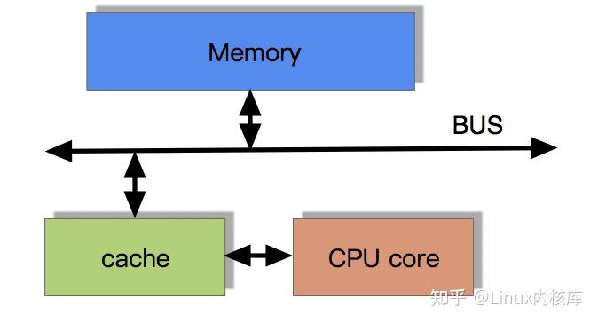
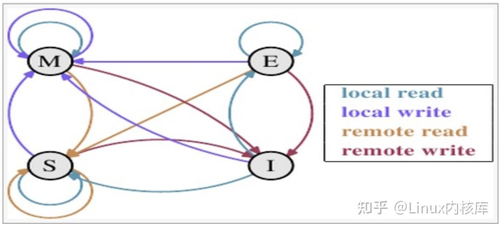
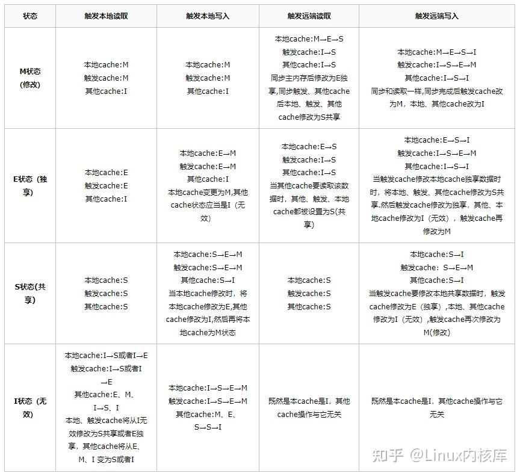
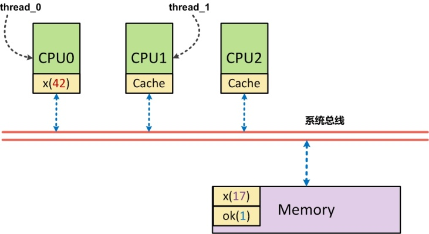

- [cpu的计算](#cpu的计算)
  - [cpu高速缓存](#cpu高速缓存)
  - [局部性原理](#局部性原理)
  - [cpu是如何访问内存的](#cpu是如何访问内存的)
  - [CPU的缓存一致性协议MESI](#cpu的缓存一致性协议mesi)
  - [指令重排](#指令重排)
    - [概述](#概述)
    - [真正会在x86/x64架构下出现重排问题的示例](#真正会在x86x64架构下出现重排问题的示例)
    - [重排类型](#重排类型)
    - [x86 x64 cpu对于指令重排的规范](#x86-x64-cpu对于指令重排的规范)
  - [内存屏障](#内存屏障)
    - [SMP架构（多处理器架构）](#smp架构多处理器架构)

# cpu的计算
## cpu高速缓存
```
CPU在摩尔定律的指导下以每18个月翻一番的速度在发展，然而内存和硬盘的发展速度远远不及CPU。这就造成了高性能能的内存和硬盘价格及其昂贵。然而CPU的高度运算需要高速的数据。为了解决这个问题，CPU厂商在CPU中内置了少量的高速缓存以解决I\O速度和CPU运算速度之间的不匹配问题。
```
**带有高速缓存的cpu的计算流程**
```
程序以及数据被加载到主内存
指令和数据被加载到CPU的高速缓存
CPU执行指令，把结果写到高速缓存
高速缓存中的数据写回主内存
```



## 局部性原理
```
在CPU访问存储设备时，无论是存取数据抑或存取指令，都趋于聚集在一片连续的区域中，这就被称为局部性原理。

时间局部性（Temporal Locality）：如果一个信息项正在被访问，那么在近期它很可能还会被再次访问。
比如循环、递归、方法的反复调用等。

空间局部性（Spatial Locality）：如果一个存储器的位置被引用，那么将来他附近的位置也会被引用。
比如顺序执行的代码、连续创建的两个对象、数组等。
```


## cpu是如何访问内存的
**内存总线**
```text
早期的X86处理器(8086/80386)有明确的地址总线和数据总线宽度,8086(20bit地址总线,16bit数据总线),80836(32bit的地址/数据总线)

现代x86/x64的处理器，内存控制器已经内置到哦了cpu芯片内部(IMC),不需要通过外部的前端总线连接北桥，“内存总线”是指cpu的IMC和内存条之间的物理接口，宽度由内存标准决定

现代内存接口的宽度：64 位
DDR、DDR2、DDR3、DDR4、DDR5 SDRAM 的基本单位是 64 位（8 字节）。
这意味着：每次内存访问，CPU 内存控制器可以一次性读写 64 位数据。
```

## CPU的缓存一致性协议MESI
多核CPU的情况下有多个一级缓存，如何保证缓存内部数据的一致,不让系统数据混乱。这里就引出了一个一致性的协议MESI。

MESI协议缓存状态
MESI 是指4中状态的首字母。每个Cache line有4个状态，可用2个bit表示，它们分别是：

缓存行（Cache line）:缓存存储数据的单元。

| 状态 | 描述 | 监听任务 |
|------|------|----------|
| M 修改 (Modified) | 该Cache line有效，数据被修改了，和内存中的数据不一致，数据只存在于本Cache中。 | 缓存行必须时刻监听所有试图读该缓存行相对就主存的操作，这种操作必须在缓存将该缓存行写回主存并将状态变成S（共享）状态之前被延迟执行。 |
| E 独享、互斥 (Exclusive) | 该Cache line有效，数据和内存中的数据一致，数据只存在于本Cache中。 | 缓存行也必须监听其它缓存读主存中该缓存行的操作，一旦有这种操作，该缓存行需要变成S（共享）状态。 |
| S 共享 (Shared) | 该Cache line有效，数据和内存中的数据一致，数据存在于很多Cache中。 | 缓存行也必须监听其它缓存使该缓存行无效或者独享该缓存行的请求，并将该缓存行变成无效（Invalid）。 |
| I 无效 (Invalid) | 该Cache line无效。 | 无 |

**MESI状态转换图**


**触发事件**




## 指令重排

### 概述
为了优化性能，根据指令的类型进行合理的排序，遵守as-if-serial语义(ps:允许编译器和处理器进行重排序，但是有一个条件，就是不管怎么重排序都不能改变**单线程执行**程序的结果。)

注意是不改变单线程执行的结果,所以可能会造成多线程的不确定性


```cpp
int value = 0;
bool flag = false;

void generate_value(){
    value = 1;
    flag = ture;
}

void visit_value(){
    if(flag){
        print("%d\n",value);
    }
}
```
对于上面这段代码，在遵循as-if-serial语义的前提下，如果重排为下面这样,那么在多线程环境下就会出问题了，在单线程环境下，generate_value和visit_value都是串行执行所以重新排列修改flag和修改value的执行不影响单线程环境下的执行结果，但是多线程环境下，线程A正在调用generate_value刚好执行完flag了，线程B正在执行visit_value中的if判断，那么此时访问的value值就是之前的旧值了
```cpp
int value = 0;
bool flag = false;

void generate_value(){
    flag = ture;
    value = 1;
}

void visit_value(){
    if(flag){
        print("%d\n",value);
        flag = false;
    }
}

```
上面这段代码中的generate_value中的两个写入指令虽然不会被x64/x86 cpu上被进行重排，但是可能在编译器优化阶段进行重排

### 真正会在x86/x64架构下出现重排问题的示例

在 x86/x64 架构下，**Store → Load 重排序** 是允许的，下面是一个经典的示例：

```cpp
#include <thread>
#include <atomic>
#include <iostream>

// 全局变量
int x = 0, y = 0;
int r1 = 0, r2 = 0;

void thread1() {
    x = 1;        // Store 操作：向内存位置 x 写入值
    r1 = y;       // Load 操作：从内存位置 y 读取值（虽然同时写入r1，但关键是从y读取）
}

void thread2() {
    y = 1;        // Store 操作：向内存位置 y 写入值  
    r2 = x;       // Load 操作：从内存位置 x 读取值（虽然同时写入r2，但关键是从x读取）
}

/**
 * 重要概念澄清：
 * 
 * Store/Load 是从共享内存的角度来看的，不是从局部变量的角度：
 * 
 * - `x = 1` 是 Store：向共享内存位置 x 存储值
 * - `r1 = y` 是 Load：从共享内存位置 y 加载值
 * 
 * 虽然 `r1 = y` 确实包含对 r1 的写入，但在内存模型中：
 * - 我们关注的是对共享内存的访问模式
 * - r1 通常是线程局部变量或寄存器，不是共享资源
 * - 关键操作是"从 y 读取"，这是一个 Load 操作
 * 
 * 所以 Store→Load 重排序指的是：
 * `x = 1`(Store to x) 和 `r1 = y`(Load from y) 之间的重排序
 */

int main() {
    for (int i = 0; i < 100000; ++i) {
        // 重置变量
        x = y = r1 = r2 = 0;
        
        // 启动两个线程
        std::thread t1(thread1);
        std::thread t2(thread2);
        
        t1.join();
        t2.join();
        
        // 如果发生了 Store→Load 重排序，可能出现 r1=0 且 r2=0 的情况
        if (r1 == 0 && r2 == 0) {
            std::cout << "发现重排序！第 " << i << " 次迭代: r1=" << r1 << ", r2=" << r2 << std::endl;
        }
    }
    return 0;
}
```

**问题分析：**
- 在没有重排序的情况下，`r1 == 0 && r2 == 0` 是不可能的
- 但由于 x86/x64 允许 Store → Load 重排序：
  - thread1 可能先执行 `r1 = y`，再执行 `x = 1`
  - thread2 可能先执行 `r2 = x`，再执行 `y = 1`
  - 结果两个线程都读到了 0 值

**解决方案：**
使用内存屏障或原子操作：
```cpp
std::atomic<int> x{0}, y{0};
std::atomic<int> r1{0}, r2{0};

void thread1() {
    x.store(1, std::memory_order_release);
    r1.store(y.load(std::memory_order_acquire), std::memory_order_relaxed);
}
```

### 重排类型
**- 1、编译器重排序**

针对程序代码语而言，编译器可以在不改变单线程程序语义的情况下，可以对代码语句顺序进行调整重新排序。

**- 2、指令集并行的重排序**

这个是针对于CPU指令级别来说的，处理器采用了指令集并行技术来讲多条指令重叠执行，如果不存在数据依赖性，处理器可以改变语句对应的机器指令执行顺序。

**- 3、内存重排序**

因为CPU缓存使用 缓冲区的方式(Store Buffere )进行延迟写入，这个过程会造成多个CPU缓存可见性的问题，这种可见性的问题导致结果的对于指令的先后执行显示不一致，从表面结果上来看好像指令的顺序被改变了，内存重排序其实是造成可见性问题的主要原因所在，其原理可在上一篇可中详细了解。


### x86 x64 cpu对于指令重排的规范
x86/x64 使用 “处理器一致性”（Processor Consistency） 模型，其基本规则如下：

这里的操作是针对于同一个内存位置(例如对同一个变量的读写操作)
操作对	是否允许 CPU 重排序
写 → 写（Store → Store）	❌ 不允许（在单个 CPU 核心上）
读 → 读（Load → Load）	❌ 不允许（逻辑上）
读 → 写（Load → Store）	❌ 不允许
写 → 读（Store → Load）	✅ 允许（这是关键！）
📌 重点：

| 重新排序活动 | x86 和 x64 | Xbox 360 |
|------------|----------|----------|
| 读取先于读取 | 否       | 是       |
| 写入先于写入 | 否       | 是       |
| 写入先于读取 | 否       | 是       |
| 读取先于写入 | 是       | 是       |

写操作之间不会被 CPU 重排序：如果你写了 A=1; B=2;，CPU 保证 A=1 的写入不会晚于 B=2 被其他 CPU 核心看到（在相同内存类型下）。
但 A=1; r1 = B; 中，CPU 可能先读 B，再写 A（即 Store-Load 重排序）。

```text
即使 x86 和 x64 CPU 确实会执行重新排序指令，但它们通常不会相对于其他读取操作重新排序读取操作。 字符串操作（MOVS 和 STOS）和 16 字节 SSE 读取可以在内部重新排序；但除此之外，读取操作不会相对于彼此重新排序。
```


## 内存屏障
内存屏障可以让CPU或者编译器在内存访问上保证**内存屏障之前的内存访问操作一定要先于其之后的完成**。内存屏障包括两类：编译器屏障和CPU内存屏障。

```
内存屏障（Memory Barrier）是什么？
内存屏障是 CPU 提供的底层指令，用于控制内存操作的执行顺序。

常见类型：
屏障类型	作用
LoadLoad	防止前面的 load 被重排到后面的 load 之前
StoreStore	防止前面的 store 被重排到后面的 store 之前
LoadStore	防止 load 和 store 重排
StoreLoad	防止 store 和 load 重排（最强，最慢）
```

```cpp
void f ()
{ 
    x = r; 
    y= 1；
}
```
对于以上代码，满足x86/x64 指令重排的规则读->写
使用volatile这个关键字来避免编译时内存乱序访问（ps:只能避免编译时的乱序访问）

### SMP架构（多处理器架构）


cpu写内存有两种方式:
- 1、write-through: 直接写回内存中
- 2、write-back: 写的时候先写回告诉存储，然后由高速存储的硬件再周转复用缓冲线（Cache Line）时自动将数据写回内存
os 经常会采取第二种写入策略，在x86/x64这种强内存模型的cpu脚骨下write back不会导致多线程的问题，因为有store buffer的FIFO保证强制顺序

弱内存模型（Weak Memory Model） 的 CPU 架构（如 ARM、RISC-V、PowerPC），Write-Back 缓存 + 缓存一致性延迟 + 无 Store Buffer FIFO 强制顺序，就真的会导致多线程同步失败。
