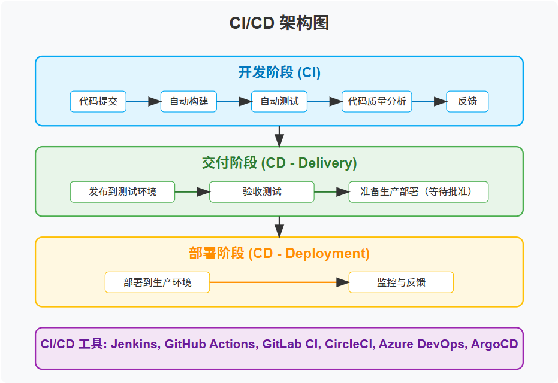

# 什么是CICD
CICD是(Continuous Delivery/Deployment)持续集成与持续交付的简称，CI/CD是现代软件开发和部署的核心实践，作为软件开发方法论中的关键环节，旨在通过自动化来提高应用交付的频率和可靠性，以更快地将软件的变更交付给用户。


# CI(持续集成) 核心概念
持续集成是一种软件开发实践，开发人员定期将代码变更合并到中央代码库中，之后自动触发构建和测试。这一过程旨在及早发现并解决问题。

```bash
CI 的主要步骤
代码提交 - 开发者将代码提交到版本控制系统
自动构建 - 系统自动编译代码
自动测试 - 执行单元测试、集成测试等
代码分析 - 进行代码质量检查和静态分析
反馈 - 向团队提供构建和测试结果

CI 的优势
早期发现并修复bug
减少集成问题
提高代码质量
促进团队协作
```

# CD(持续交付/部署) 核心概念
持续交付确保代码变更可以被快速/安全地部署到生产环境,CD就是将这一过程自动化了。

```bash
持续交付：自动化构建、测试和准备变更以供部署，但实际部署需要手动批准
持续部署：每个通过自动化测试的变更都会自动部署到生产环境
CD 的主要步骤
环境配置 - 准备测试、预发布和生产环境
部署自动化 - 实现一键或全自动部署
监控与回滚 - 监测部署后的应用性能，必要时可快速回滚
持续改进 - 不断优化交付流程
CI/CD 工具生态系统
市场上有多种强大的CI/CD工具可供选择，包括：

Jenkins：开源的自动化服务器
GitHub Actions：GitHub平台的集成CI/CD解决方案
GitLab CI/CD：GitLab提供的内置CI/CD功能
CircleCI：基于云的CI/CD服务
Travis CI：针对开源项目的CI服务
Azure DevOps：微软提供的开发工具套件
ArgoCD：Kubernetes的声明式GitOps CD工具
```

# CI/CD PipeLine
实现自动化软件交付地核心流程

一般的流水线流程如下:
```bash
代码提交 → 构建 → 测试 → 部署到测试环境 → 验收测试 → 部署到生产环境
```

以github actions为例:
```yaml
name: CI/CD Pipeline
on:
  push:
    branches: [ main ]
  pull_request:
    branches: [ main ]
jobs:
  build:
    runs-on: ubuntu-latest
    steps:
    - uses: actions/checkout@v3
    - name: Set up Node.js
      uses: actions/setup-node@v3
      with:
        node-version: '18'
    - name: Install dependencies
      run: npm install
    - name: Run tests
      run: npm test
    - name: Build
      run: npm run build
  deploy:
    needs: build
    runs-on: ubuntu-latest
    if: github.ref == 'refs/heads/main'
    steps:
    - name: Deploy to production
      run: |
        # 部署脚本
        echo "Deploying to production..."
```
# CI/CD 最佳实践
```bash
技术实践
基础设施即代码（IaC）：使用代码定义和管理基础设施
分支策略：采用Git Flow或类似的分支管理策略
环境一致性：确保开发、测试和生产环境的一致性
自动化测试：维护全面的测试套件，包括单元测试、集成测试和端到端测试
版本控制：对代码、配置和环境进行严格的版本控制

团队实践
小批量工作：频繁提交小规模的代码变更
快速反馈：优化流程以获取更快的反馈
持续改进：定期回顾和优化CI/CD流程
质量第一：将质量内建于开发过程中，而非事后检查
```

# CI/CD架构图


# CI/CD 与 DevOps 的关系
CI/CD 是 DevOps 文化和实践的核心组成部分。DevOps 是一种文化和实践的集合，旨在通过打破开发（Dev）和运维（Ops）之间的壁垒来提高软件交付的速度和质量。

DevOps 与 CI/CD 的协同作用
DevOps 提供文化和组织框架
CI/CD 提供技术实现方法
两者共同推动软件交付流程的改进
CI/CD 实施步骤
对于零基础的团队，实施 CI/CD 可以遵循以下渐进式步骤：

建立版本控制系统：采用 Git 等分布式版本控制系统
自动化构建过程：使用 Maven、Gradle、npm 等构建工具
引入自动化测试：编写并自动执行单元测试和集成测试
设置 CI 服务器：配置 Jenkins 或 GitHub Actions 等工具
实现持续交付：建立测试、预发布和生产环境
逐步实现持续部署：从低风险的服务开始实现全自动部署
监控与改进：建立监控系统，持续优化流程

# CI/CD 实践中的挑战与解决方案
常见挑战
测试自动化不足：无法保证代码质量
环境不一致：开发环境与生产环境差异导致部署问题
安全集成不足：CI/CD 流程中缺乏安全检查
遗留系统集成：老旧系统难以纳入现代 CI/CD 流程
组织文化阻力：团队可能抵制变更

解决方案
测试策略改进：构建全面的测试金字塔，包括单元测试、集成测试和端到端测试
容器化技术：使用 Docker 和 Kubernetes 确保环境一致性
DevSecOps：将安全检查集成到 CI/CD 流程中
逐步现代化：为遗留系统创建 API 层，逐步实现现代化
培训和转变：投资于团队培训，培养持续改进的文化

衡量 CI/CD 成功的关键指标
部署频率：成功部署到生产环境的频率
变更准备时间：从代码提交到准备好部署的时间
平均恢复时间：从故障发生到恢复的平均时间
变更失败率：导致生产故障的变更百分比
代码质量指标：代码覆盖率、复杂度等
首次通过率：CI/CD 流水线首次运行就成功的百分比

# CI/CD 与微服务架构
CI/CD 实践与微服务架构能够相互促进，实现更快速、更可靠的软件交付。

协同优势
独立部署：每个微服务可以独立构建和部署
粒度控制：可以对不同的微服务应用不同的 CI/CD 策略
故障隔离：单个服务的问题不会影响整个系统
技术多样性：不同的团队可以选择最适合其服务的技术栈
未来趋势
CI/CD 领域正在不断发展，未来趋势包括：

GitOps：以 Git 为核心的操作流程，所有变更通过 Git 提交触发
低代码/无代码 CI/CD：简化配置和管理的可视化工具
AI/ML 辅助测试：智能化的测试生成和执行
自愈系统：自动检测和修复部署和运行时问题
安全移左：更早、更深入地将安全集成到开发流程中

# 总结
CI/CD 是现代软件开发不可或缺的一部分，通过自动化和标准化的流程，帮助团队更快、更可靠地交付高质量软件。对于零基础的团队来说，从小处开始，逐步实施，重视文化转变与技术实践同等重要，最终能够实现高效的软件交付流程，为企业带来竞争优势。